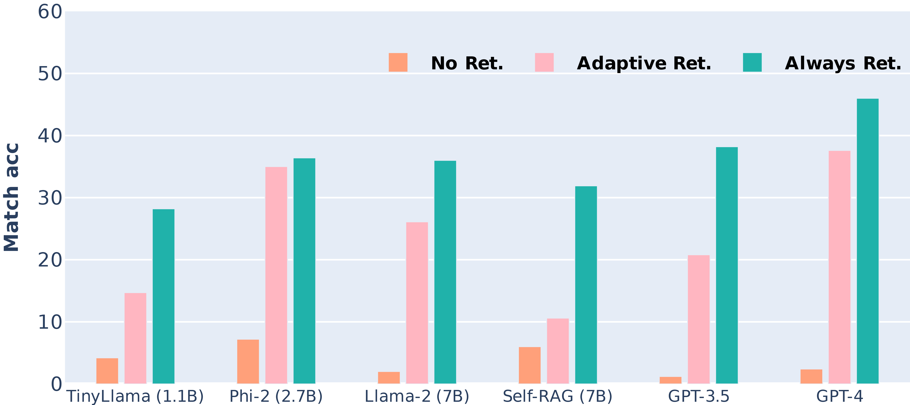
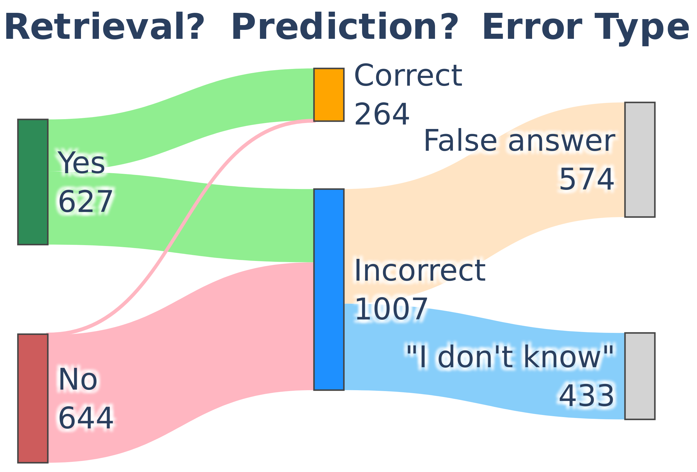

# RetrievalQA: Assessing Adaptive Retrieval-Augmented Generation for Short-form Open-Domain Question Answering

This repository includes the dataset and code of the paper: [RetrievalQA: Assessing Adaptive Retrieval-Augmented Generation for Short-form Open-Domain Question Answering](https://arxiv.org/abs/2402.16457) (**Findings of ACL 2024**) by *Zihan Zhang*, *Meng Fang*, and *Ling Chen*.

**⬇️ Download data:**
[`data/retrievalqa.jsonl`](https://github.com/hyintell/RetrievalQA/tree/main/data) or
[🤗 HuggingFace Dataset](https://huggingface.co/datasets/hyintell/RetrievalQA) 


- [RetrievalQA: Assessing Adaptive Retrieval-Augmented Generation for Short-form Open-Domain Question Answering](#retrievalqa-assessing-adaptive-retrieval-augmented-generation-for-short-form-open-domain-question-answering)
  - [📢 News](#-news)
  - [📖 Introduction](#-introduction)
  - [⚙️ Install Dependencies](#️-install-dependencies)
  - [📋 Data Download \& Statistics](#-data-download--statistics)
  - [📊 Reproduce the Results](#-reproduce-the-results)
    - [Run LLM baselines](#run-llm-baselines)
    - [Run Self-RAG with specified threshold](#run-self-rag-with-specified-threshold)
    - [Run Self-RAG without threshold](#run-self-rag-without-threshold)
  - [🕸️ Retriever](#️-retriever)
  - [🌟Citation](#citation)
  - [Acknowledgement](#acknowledgement)
  - [🐞Questions?](#questions)

## 📢 News
- **[2024-05-28] Update dataset: add additional 1,514 data that do not require external retrieval**
- **[2024-05-16] Our paper been accepted to the ACL Findings 2024 🎉!**
- **[2024-03] Upload code and dataset.**
- **[2024-02] The paper is available on Arxiv.**

---

## 📖 Introduction

To evaluate how **adaptive RAG** performs, we collect questions that the knowledge necessary to answer the questions is absent from LLMs. Therefore, LLMs must truthfully decide whether to retrieve to be able to answer the questions correctly.

<p align="center">
  
  <br>
  <em>Comparison between <b>No, Adaptive</b>, and <b>Always</b> retrieval on <b>RetrievalQA</b></em>
</p>

<p align="center">
  
  <br>
  <em>At least half of the time, GPT-3.5 is unaware that it needs retrieval (red)</em>
</p>


## ⚙️ Install Dependencies

The code has been tested under Python 3.9. The following are the steps to set up the environment.

Create conda environment:
```bash
conda create -n retrievalqa python=3.9 -y
conda activate retrievalqa
```

Install [PyTorch](https://pytorch.org/get-started/previous-versions/#linux-and-windows-2): we used Pytorch 2.1.2 and CUDA 12.1 in the experiment; however, other versions might also work.
```bash
conda install pytorch==2.1.2 torchvision==0.16.2 torchaudio==2.1.2 pytorch-cuda=12.1 -c pytorch -c nvidia
```

Install libraries:
```bash
pip install -r requirements.txt
```

## 📋 Data Download & Statistics

**RetrievalQA** is a short-form open-domain question answering (QA) dataset comprising 2,785 questions covering new world and long-tail knowledge. It contains 1,271 questions needing external knowledge retrieval and 1,514 questions that most LLMs can answer with internal parametric knowledge.

RetrievalQA is available at the [`data/retrievalqa.jsonl`](https://github.com/hyintell/RetrievalQA/tree/main/data), you can also download it from [🤗 HuggingFace Dataset](https://huggingface.co/datasets/hyintell/RetrievalQA). `data/retrievalqa_gpt4.jsonl` contains only 250 selected examples used to test GPT-4 to save costs.

|      Category       | Data Source | # Original | # After Filtering | # Avg. Q Tokens | # Avg. Ans Tokens |
| :-----------------: | :---------: | :---------: | :----------------: | :--------------: | :----------------: |
| New world knowledge | RealTimeQA  |     397     |        188         |        19        |        3.1         |
|                     |   FreshQA   |     127     |         54         |       13.8       |        3.9         |                    
| Long-tail knowledge |   ToolQA    |     100     |         75         |       21.7       |        3.5         |
|                     |    PopQA    |    1,399    |        659         |       8.8        |         4          |                    
|                     |  TriviaQA   |    7,313    |        295         |       17.3       |        5.9         |                    
|    Total/Average    | **RetrievalQA** |    **9,336**    |       **1,271**        |       **13.2**       |        **4.3**         |


Here is an example of a data instance:
```json
{
  "data_source": "realtimeqa", 
  "question_id": "realtimeqa_20231013_1", 
  "question": "What percentage of couples are 'sleep divorced', according to new research?", 
  "ground_truth": ["15%"], 
  "context": [
    {
      "title": "Do We Sleep Longer When We Share a Bed?", 
      "text": "1.4% of respondents have started a sleep divorce, or sleeping separately from their partner, and maintained it in the past year. Adults who have ..."
    }, ...
  ],
  "param_knowledge_answerable": 0
}
```

where:
- `data_source`: the origin dataset of the question comes from
- `question`: the question
- `ground_truth`: a list of possible answers
- `context`: a list of dictionaries of retrieved relevant evidence. Note that the `title` of the document might be empty
- `param_knowledge_answerable`: 0 indicates the question needs external retrieval; 1 indicates the question can be answerable using its parametric knowledge


> [!IMPORTANT]
> We have pre-retrieved relevant documents for each question, as shown in the `context` field in the dataset. You can use these pre-retrieved documents for generation; however, please note that some retrieved documents might **not** have the information necessary to answer the question due to the retriever. 
> 
> In this paper, we focus more on the **retrieval accuracy** instead of the quality of the retriever. That is, we are more interested in *how accurate adaptive retrieval methods are in deciding when to retrieve*. You can retrieve documents yourself, as shown in the below [Retriever](#🕸️-retriever) section.


## 📊 Reproduce the Results

We have provided executable scripts to reproduce the results. Refer to the `.sh` files for different settings. If you wish to test GPT-3.5/4, you need to provide OpenAI API in [`openai_config.txt`](https://github.com/hyintell/RetrievalQA/blob/main/openai_config.txt).

### Run LLM baselines

```bash
bash run_lm.sh
```

- `prompt_method`: choose from `vanilla` prompting or `TAARE` prompting
- `retrieval_modes`: choose from `["adaptive_retrieval", "always_retrieval", "no_retrieval"]`
- `model_names`: choose LMs from [HuggingFace](https://huggingface.co/models) or use OpenAI API
  
> [!NOTE]  
> You can choose any text generation models from HuggingFace; however, we recommend choosing instruction fine-tuned models and using the suggested prompt templates. Additionally, since we use [vllm](https://github.com/vllm-project/vllm?tab=readme-ov-file#about) for accelerated inference, you should use the models that are supported by vllm. Otherwise, you can use [HF Pipeline](https://huggingface.co/docs/transformers/en/pipeline_tutorial) for inference.


### Run Self-RAG with specified threshold

```bash
bash run_selfrag.sh
```

- `thresholds`: set retrieval threshold


### Run Self-RAG without threshold

By default, `threshold=None`, which means Self-RAG will only retrieve when generating `[Retrieval]` tokens.

```bash
bash run_selfrag_no_threshold.sh
```

The code will generate a `score_*.json` file which contains all metrics, and a `predic_*.jsonl` file which contains all model predictions. We provide our results under the `results/reproduce` folder.


## 🕸️ Retriever

In the paper, for questions from different sources, we use differnt retrievers.

**RealTimeQA and FreshQA**

For new world knowledge questions, we use Google Search API provided by [SerpApi](https://serpapi.com/). You need to setup a SerpApi API key and refer to [`google_search.py`](https://github.com/hyintell/RetrievalQA/blob/main/google_search.py#L4) for searching. We only use the `title` and `snippet` from the search results.

**ToolQA**

The agenda corpus is synthesized with virtual names and events.
We use the retriever provided by [ToolQA](https://github.com/night-chen/ToolQA?tab=readme-ov-file#retriever) and search relevant documents from the [Chroma](https://github.com/night-chen/ToolQA/blob/main/benchmark/ReAct/code/tools/text/agenda_retriever.py) vector database.


**PopQA and TriviaQA**

We use the pre-retrieved documents provided by Self-RAG. You can follow their [retriever setup](https://github.com/AkariAsai/self-rag?tab=readme-ov-file#retriever-setup) to retrieve documents from Wikipedia.


## 🌟Citation

If you find our code, data, or the paper useful, please cite the paper:

```bibtex
@misc{zhang2024retrievalqa,
      title={RetrievalQA: Assessing Adaptive Retrieval-Augmented Generation for Short-form Open-Domain Question Answering}, 
      author={Zihan Zhang and Meng Fang and Ling Chen},
      year={2024},
      eprint={2402.16457},
      archivePrefix={arXiv},
      primaryClass={cs.CL}
}
```

## Acknowledgement

Our data and code are based on previous works:
- [RealTimeQA](https://github.com/realtimeqa/realtimeqa_public)
- [FreshQA](https://github.com/freshllms/freshqa)
- [ToolQA](https://github.com/night-chen/ToolQA)
- [PopQA](https://github.com/AlexTMallen/adaptive-retrieval)
- [TriviaQA](https://arxiv.org/abs/1705.03551)
- [Self-RAG](https://github.com/AkariAsai/self-rag)


## 🐞Questions?
If you have questions, please raise an [issue](https://github.com/hyintell/RetrievalQA/issues). 
